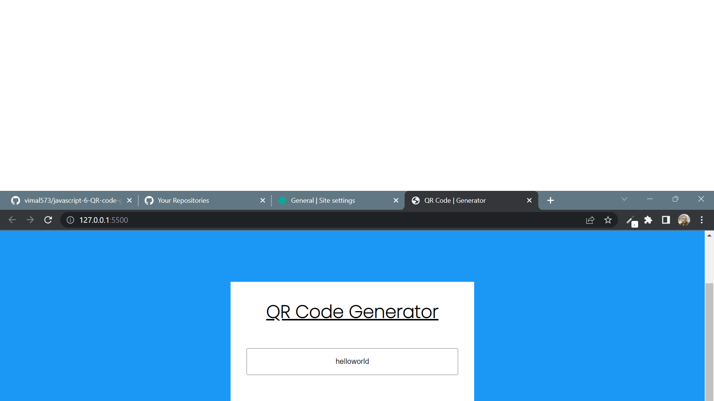

# Javascript Assignment QR Code Generator

## QR Code Generator [Live Link](https://qr-code-generator-js-6.netlify.app/)

- Skills Gained in this project

  - learn to handle promises

---

## Time taken to finish this project

- 15 minutes to complete it

#### Screenshot

